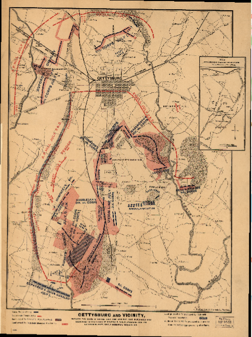
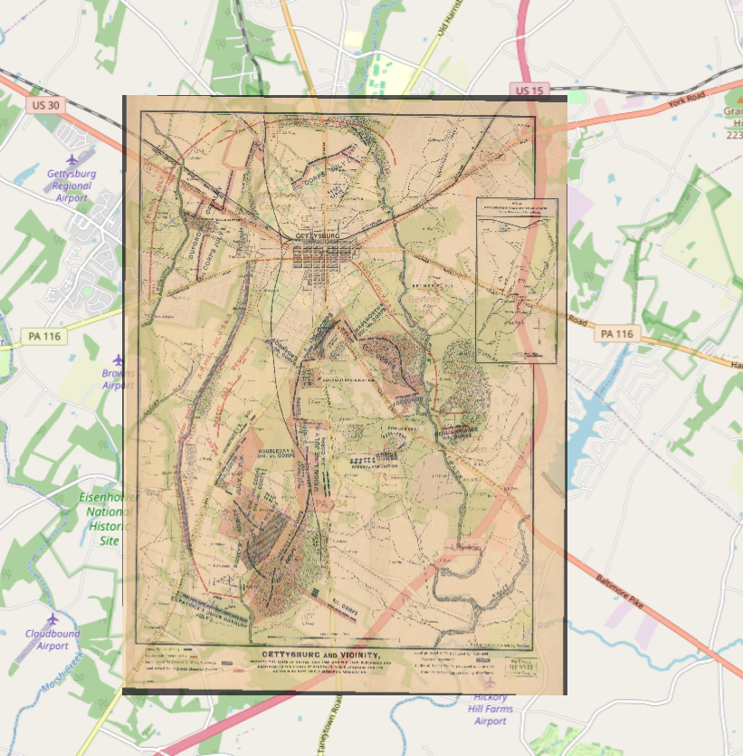
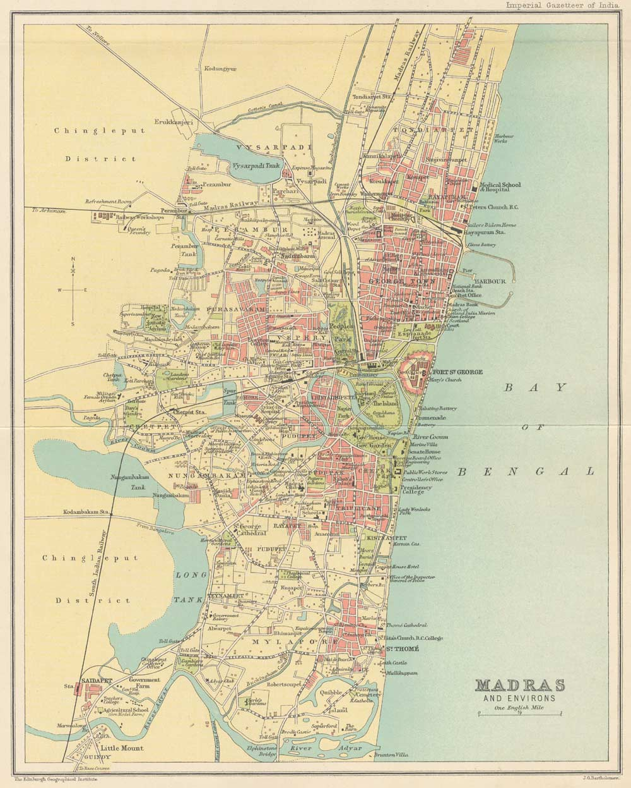
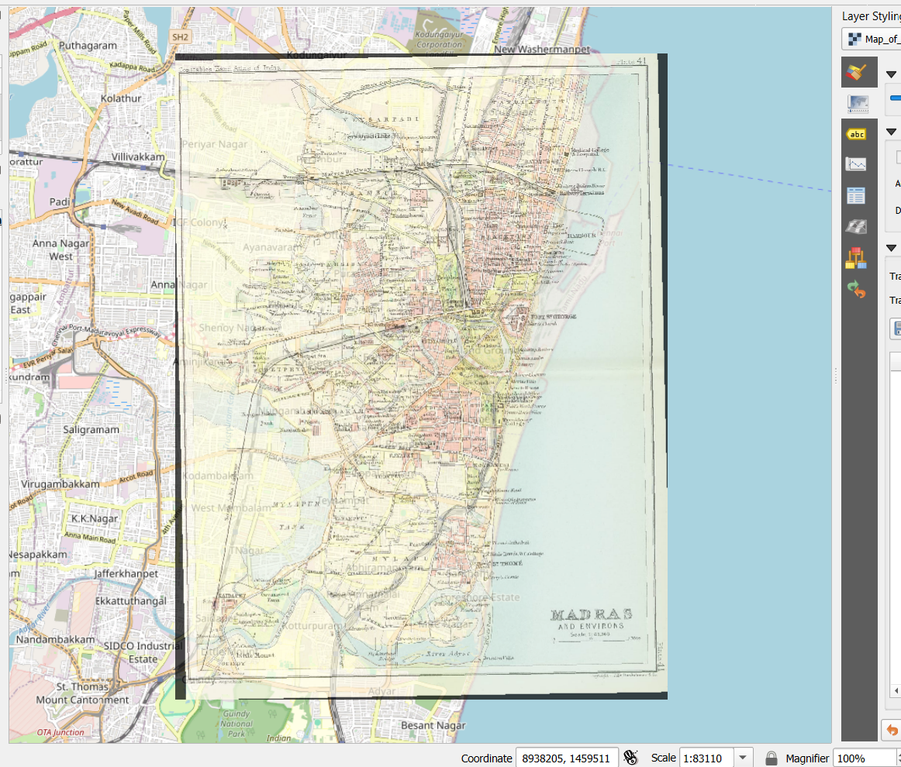

# GeoreferenceHistoricalMaps
I georeferenced two historical maps - Gettysburg and Madras. Based on this video https://youtu.be/XV62QEk0Cxg?si=9BsywYjNtJWNWury

## Gettysburg Historical Map

| Original Map | Georeferenced Overlay |
|---------------|----------------------|
|  |  |

## Madras (Chennai) Historical Map

| Original Map | Georeferenced Overlay |
|---------------|----------------------|
|  |  |
